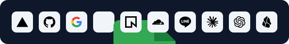
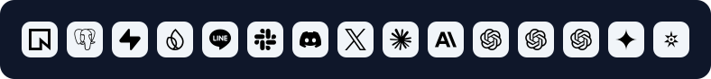
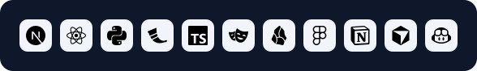
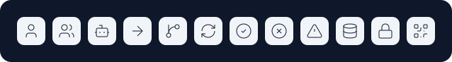
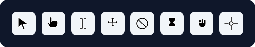
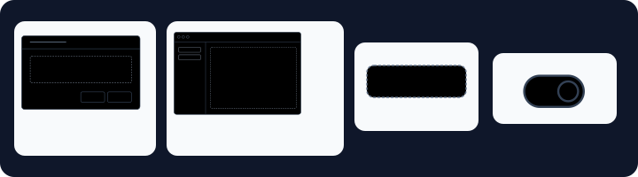

# doc-assets

<p align="center">
  
</p>

<p align="center">
  
</p>

<p align="center">
  
  
  
  
  
</p>

<p align="center">
  <a href="preview-brands.html">brands</a> ·
  <a href="preview-badges.html">badges</a> ·
  <a href="preview-tools.html">tools</a> ·
  <a href="preview-frames.html">frames</a> ·
  <a href="preview-gui.html">gui</a> ·
  <a href="preview-og.html">og</a>
</p>

---

## brands

<p align="center">
  <br />
  <br />
  
</p>

<p align="center"><code>icons/brands/</code> · <a href="preview-brands.html">preview</a></p>

---

## symbols

<p align="center">
  
</p>

---

## badges

<p align="center">
  
  
  
  
  
  
  
  
  
</p>

<p align="center"><a href="preview-badges.html">preview</a> · <a href="snippets/badges.md">snippets</a></p>

---

## screenshot stack

<p align="center">
  
</p>

<p align="center">
  
</p>

<p align="center">
  
  &nbsp;&nbsp;
  
</p>

<p align="center">
  
</p>

<p align="center">
  
</p>

<p align="center"><a href="preview-frames.html">frames</a> · <a href="preview-gui.html">gui</a></p>

---

## og · favicon

<p align="center">
  
  
  
  
</p>

<p align="center">
  
  
  
</p>

<p align="center"><a href="preview-og.html">preview-og</a></p>

---

## use

<p align="center">
  
</p>

```bash
git clone https://github.com/tatsunoritojo/doc-assets.git
open doc-assets/preview-brands.html
```

```markdown


```

```bash
cp -R icons badges/static frames cursors ./docs/assets/
```

<details>
<summary>more</summary>

- flows → <a href="templates/flows/">templates/flows/</a>
- tokens → <a href="tokens/mermaid.md">tokens/mermaid.md</a>
- catalog → <a href="catalog.md">catalog.md</a>
- licenses → Lucide ISC · Simple Icons CC0 · kit <a href="LICENSE">MIT</a> · <a href="LICENSES.md">LICENSES.md</a>

</details>
