# doc-assets

<p align="center">
  
  &nbsp;
  
  &nbsp;
  
  &nbsp;
  
  &nbsp;
  
  &nbsp;
  
  &nbsp;
  
  &nbsp;
  
  &nbsp;
  
  &nbsp;
  
</p>

<p align="center">
  <strong>README・サービス図・提案資料のためのビジュアル素材キット</strong><br />
  アイコンを探す時間を、説明を書く時間に変える。
</p>

<p align="center">
  
  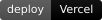
  
  
  
  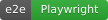
</p>

<p align="center">
  <a href="preview-brands.html">brands</a> ·
  <a href="preview-badges.html">badges</a> ·
  <a href="preview-tools.html">tools</a> ·
  <a href="preview-frames.html">frames</a> ·
  <a href="preview-gui.html">gui</a> ·
  <a href="preview-og.html">og</a>
</p>

---

## コンセプト

| よくある現実 | このキット |
|--------------|------------|
| 毎回 Simple Icons / 検索で探す | **決まったパス**から貼る |
| README だけ文字の壁 | **ロゴ・バッジ・枠**で一目でスタックが分かる |
| サービス図が味気ない | **カラー brands + Mermaid 雛形** |
| 偽 UI イラストで違和感 | **実スクショ + デバイス枠 + カーソル注釈**（A+C） |

画面の中身は**本物のスクショ**が正。手描きの色付きダッシュボードは本線にしない。

---

## ブランド（カラー本線）

<p align="center">
  
  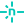
  
  
  
  
  
  
  
  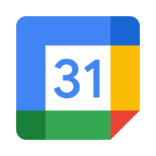
  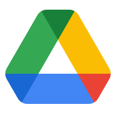
  
  
  
  
  
  
  
  
  
  
  
  
  
  
  
  
  
  
  
  
  
  
  
  
  
</p>

| | |
|--|--|
| カラー | `icons/brands/` |
| 単色 | `icons/brands-mono/` |
| 一覧 | [preview-brands.html](./preview-brands.html) · [catalog.md](./catalog.md) |

```markdown


```

---

## フロー記号（Lucide）

<p align="center">
  
  
  
  
  
  
  
  
  
  
  
  
</p>

人・矢印・状態・DB は線画のまま（図がうるさくならない）。

---

## バッジ

<p align="center">
  
  
  
  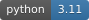
  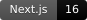
  
  
</p>

静的 SVG: `badges/static/` · Shields 用スニペット: [snippets/badges.md](./snippets/badges.md)

---

## サービスフロー雛形

コピーしてサービス名だけ差し替える Mermaid テンプレ（10 本）。

| | テーマ |
|--|--------|
| [01](templates/flows/01-google-oauth.md) | Google OAuth |
| [02](templates/flows/02-webhook-verify-forward.md) | Webhook 検証→転送 |
| [03](templates/flows/03-desktop-sheets-gas.md) | Desktop → Sheets → GAS |
| [05](templates/flows/05-vercel-neon-api.md) | Vercel → Neon → API |
| [09](templates/flows/09-incident-plan-b.md) | 障害 Plan B |
| [10](templates/flows/10-ai-report-grounded.md) | AI レポート接地 |

色の共通定義: [tokens/mermaid.md](./tokens/mermaid.md) · 一覧: [templates/flows/](./templates/flows/)

---

## デバイス枠 + カーソル（A+C）

実スクショの上に枠とポインタを重ねて「どこを見るか」を示す。

<p align="center">
  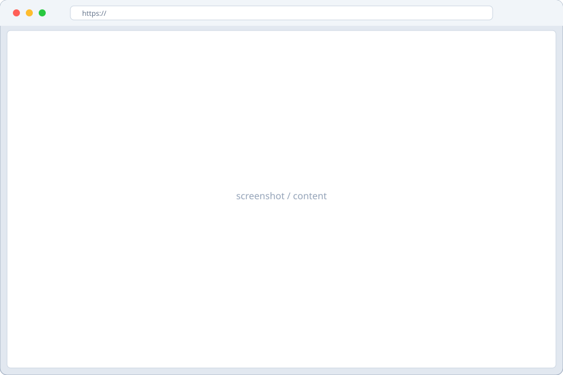
</p>

<p align="center">
  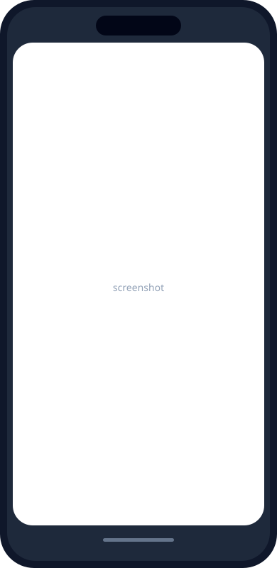
  &nbsp;&nbsp;&nbsp;
  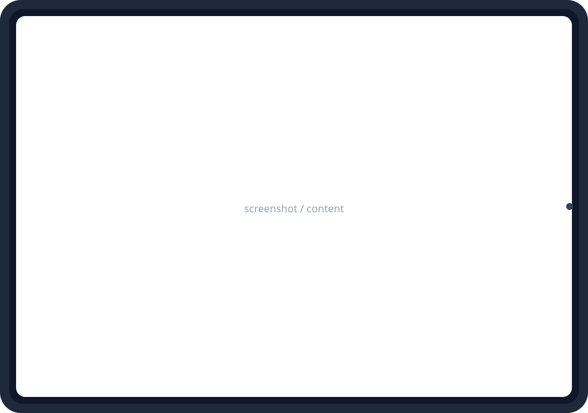
</p>

<p align="center">
  
  
  
  
  
  
  
</p>

| 素材 | パス |
|------|------|
| 枠（プレースホルダ） | `frames/browser.svg` など |
| 枠（重ね用・画面が穴） | `frames/*-mask.svg` |
| カーソル | `cursors/` |
| ワイヤ UI 記号 | `windows/` `chrome/`（線のみ） |

手順: [snippets/frames.md](./snippets/frames.md) · [snippets/gui-chrome.md](./snippets/gui-chrome.md)

---

## OGP / favicon

公開 URL を SNS に貼ったときのプレビュー用（1200×630）。

<p align="center">
  
</p>

<p align="center">
  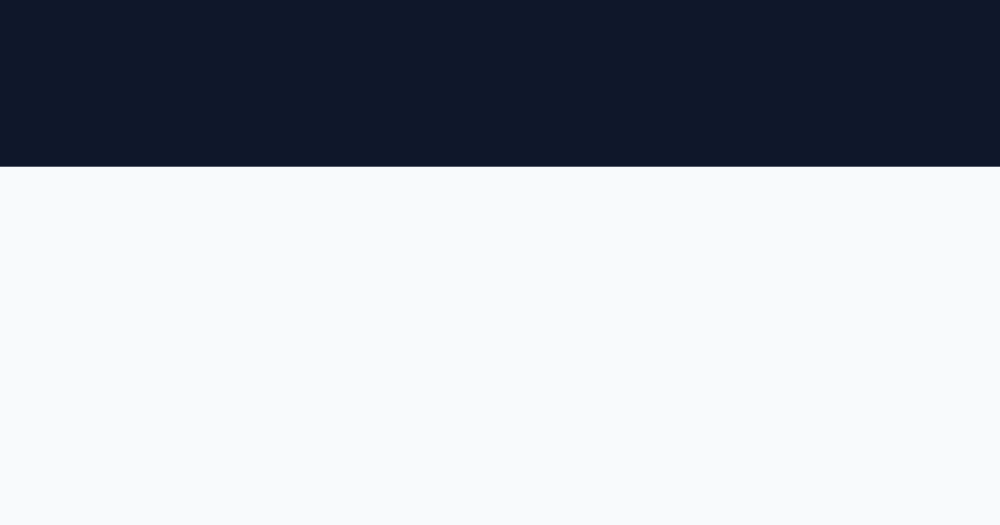
  
  
</p>

<p align="center">
  
  &nbsp;
  
  &nbsp;
  
</p>

用途別テンプレ（blog / product / portfolio / minimal …）: [preview-og.html](./preview-og.html) · [snippets/og-favicon.md](./snippets/og-favicon.md)

---

## ディレクトリ

```
doc-assets/
├── icons/brands/          # カラーロゴ（本線）
├── icons/brands-mono/     # 単色
├── icons/{actors,flow,…}/ # Lucide
├── badges/static/         # 静的バッジ
├── templates/flows/       # Mermaid 雛形
├── tokens/                # 色・classDef
├── frames/                # デバイス枠
├── cursors/               # ポインタ注釈
├── windows/ chrome/       # ワイヤ記号
├── og/ favicon/           # 共有カード・favicon
├── snippets/              # コピペ集
└── preview-*.html         # ブラウザ一覧
```

---

## 使い方（最短）

```bash
git clone https://github.com/tatsunoritojo/doc-assets.git
cd doc-assets
# プレビュー
open preview-brands.html
```

```bash
# 自分のプロジェクトへ
cp -R icons ./docs/assets/icons
cp -R badges/static ./docs/assets/badges
```

```markdown
| Host |  Vercel |
| DB   |  Neon |
```

Tech 表の型: [snippets/tools-stack.md](./snippets/tools-stack.md)

---

## 出典・ライセンス

| 素材 | ライセンス |
|------|------------|
| Lucide | ISC |
| Simple Icons | CC0（商標は各社） |
| キット文書・ワイヤ・構成 | [MIT](./LICENSE) |

詳細: [LICENSES.md](./LICENSES.md)

---

## 方針

- **足りないものは都度追加**
- 色付き「偽 UI」は `archive/` のみ（本線に戻さない）
- 画面説明 = **実スクショ + 枠 + カーソル**
