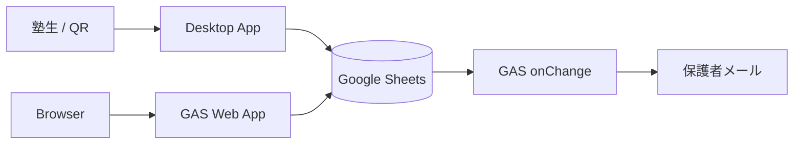
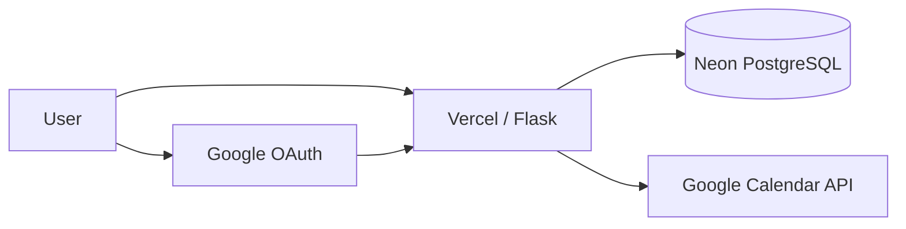
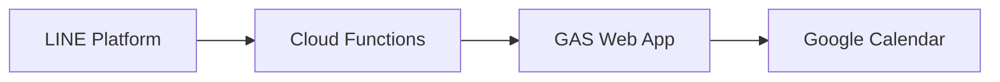

# Mermaid でのサービスフロー

Mermaid はローカル SVG ファイルをノード内画像として安定に埋め込めない環境が多い。  
**推奨**: ノードラベルにサービス名を書き、図の上下で本キットの SVG を並べる。

## サービスフロー雛形（テキスト）



## SaaS（Vercel + DB + 外部 API）



## LINE Bot 系



## アイコンを添える README パターン

```markdown
## 構成

| 役割 | サービス |
|------|----------|
| Edge |  Vercel |
| DB |  Neon |
| 予定 |  Google Calendar |

\`\`\`mermaid
flowchart LR
  A[User] --> B[Vercel]
  B --> C[Neon]
\`\`\`
```
