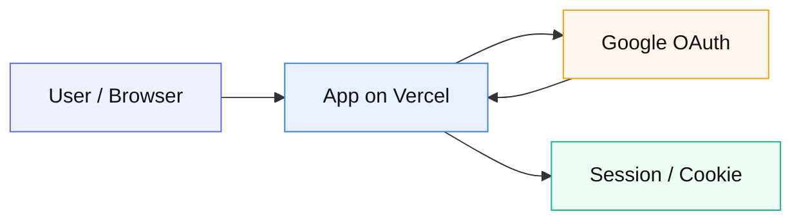

# 01 — Google OAuth ログイン

**由来:** SaaS Web アプリの典型  
**アイコン:** `brands/google.svg` `brands/vercel.svg`

| 段階 | 内容 |
|------|------|
| 1 | アプリが認可 URL へリダイレクト |
| 2 | Google 同意（スコープは最小） |
| 3 | callback で code → token |
| 4 | セッション確立（JWT に認可を焼きすぎない） |

**注意:** redirect_uri は本番と完全一致。Vercel env は `printf` で投入（末尾改行注意）。
