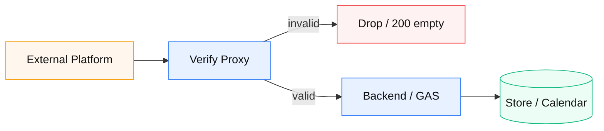

# 02 — Webhook 検証 → 転送

**由来:** daybell（LINE → Cloud Functions → GAS）  
**アイコン:** `brands/line.svg` `brands/googlecloud.svg` `brands/googleappsscript.svg`

| 段階 | 内容 |
|------|------|
| 1 | 署名ヘッダ検証（HMAC 等） |
| 2 | 失敗は攻撃面を広げず黙殺可 |
| 3 | 成功のみ本体へ転送 + 共有 secret |
| 4 | 本体は業務処理のみ |

**注意:** GAS は HTTP ヘッダが取れない制約 → 署名は手前プロキシ必須、が定石。
