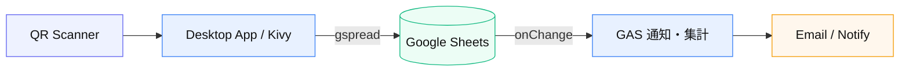

# 03 — Desktop → Sheets → GAS onChange

**由来:** Desktop + スプレッドシート運用  
**アイコン:** `brands/python.svg` `brands/googlesheets.svg` `brands/googleappsscript.svg` `ui/qr-code.svg`

| 段階 | 内容 |
|------|------|
| 1 | QR → 学籍解決 → Sheets に append |
| 2 | 3 問回答を行更新 |
| 3 | GAS が変更検知で保護者通知 |
| 4 | ポータルは別経路で Sheets 参照 |

**注意:** Desktop は GAS HTTP を呼ばない。サービスアカウント権限が本番到達点。
