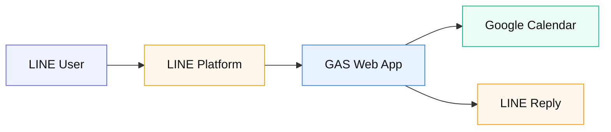

# 04 — LINE → GAS → Google Calendar

**由来:** LINE Bot + Calendar  
**アイコン:** `brands/line.svg` `brands/googleappsscript.svg` `brands/googlecalendar.svg`

| 段階 | 内容 |
|------|------|
| 1 | 友だち追加 / メッセージ |
| 2 | 対話で開始・終了・目標を収集 |
| 3 | Calendar にイベント作成 |
| 4 | リッチメニューで確認 |

**簡易 vs 推奨:** 簡易= GAS 直結 + ユーザー ID ホワイトリスト。推奨= 署名プロキシ（02 参照）。
