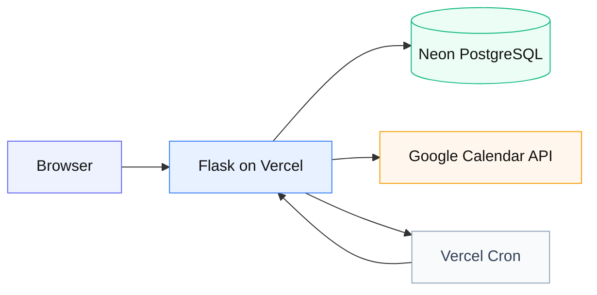

# 05 — Vercel → Neon → 外部 API

**由来:** shifree  
**アイコン:** `brands/vercel.svg` `brands/neon.svg` `brands/postgresql.svg` `brands/googlecalendar.svg`

| 段階 | 内容 |
|------|------|
| 1 | リクエスト → サーバレスエントリ |
| 2 | pooled / unpooled を用途で使い分け |
| 3 | 外部 API はタイムアウトと再試行を明示 |
| 4 | マイグレーションは自動追従に賭けない |

**注意:** 本番 migration は制御された単一ステップ。`/health/schema` で positive 検証。
