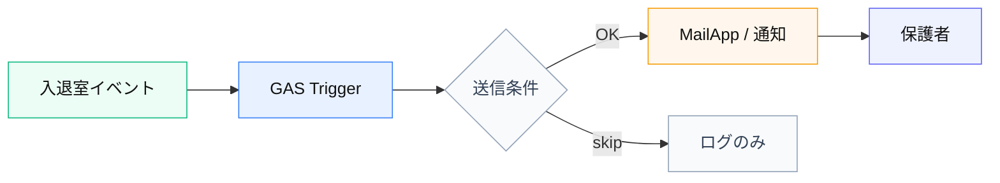

# 06 — 保護者通知メール

**由来:** onedrop 出席 GAS  
**アイコン:** `brands/gmail.svg` `brands/googleappsscript.svg` `brands/googlesheets.svg`

| 段階 | 内容 |
|------|------|
| 1 | Sheets 変更 or 明示トリガ |
| 2 | 重複送信・テスト ID 除外 |
| 3 | 文言は運用マニュアルと一致 |
| 4 | 失敗は握り潰さずログ |

**注意:** 個人情報。ログに本文フルを残さない。
