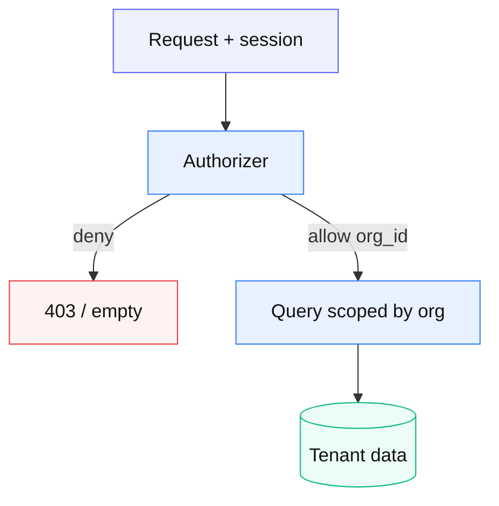

# 07 — マルチテナント org 境界

**由来:** shifree / attendance-saas 方針  
**アイコン:** `actors/building.svg` `actors/users.svg` `data/database.svg`

| 段階 | 内容 |
|------|------|
| 1 | 認証 ≠ 認可。毎リクエストで org を解決 |
| 2 | クエリは必ず org スコープ |
| 3 | 管理 API はロール dual-check |
| 4 | 招待リンクは一回性・期限 |

**注意:** JWT に「強い認可」を焼かない（失効が難しい）。
