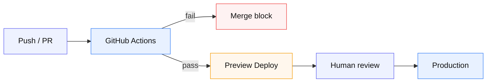

# 08 — CI → Preview → Production

**由来:** PR preview → production  
**アイコン:** `brands/github.svg` `brands/vercel.svg` `status/check.svg`

| 段階 | 内容 |
|------|------|
| 1 | lint / test / build |
| 2 | PR に preview URL |
| 3 | main は protected + 必要なら reviewers |
| 4 | 業務時間帯の公開 git はガード対象 |

**注意:** production 自動デプロイを切っているリポでは workflow_dispatch を正とする。
