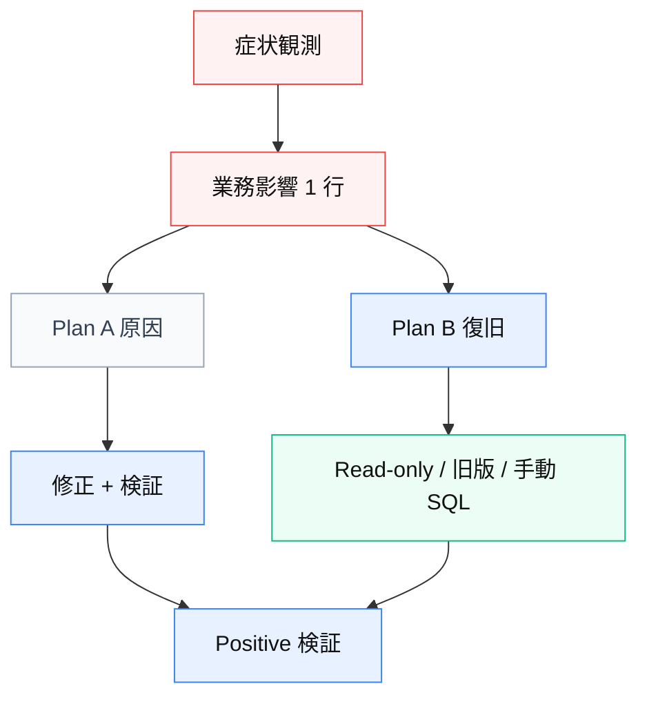

# 09 — 障害時 Plan B（読み取り / 切り戻し）

**由来:** 障害対応テンプレ + shifree 復旧経験  
**アイコン:** `status/error.svg` `status/warn.svg` `infra/shield.svg`

| 段階 | 内容 |
|------|------|
| 1 | 誰が何にアクセスできないか（業務語彙） |
| 2 | Plan B を先に（読み取り専用 DB・旧デプロイ） |
| 3 | Plan A は並行（ログ・スキーマ） |
| 4 | 復旧定義を先に書いてから「完了」 |

**注意:** コールドスタート自動 migrate 再有効化で再発させない。
