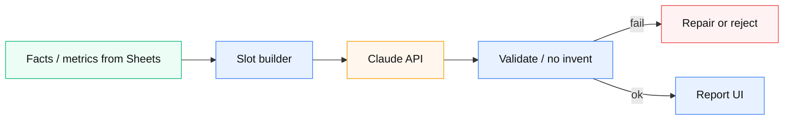

# 10 — AI レポート生成（スロット接地）

**由来:** 接地付き AI レポート  
**アイコン:** `brands/claude.svg` `brands/anthropic.svg` `brands/googlesheets.svg`

| 段階 | 内容 |
|------|------|
| 1 | 数値はスロット。モデルに生データ丸投げしない |
| 2 | system で創作禁止・根拠必須 |
| 3 | 出力検証（句点・禁止語・探索モード制約） |
| 4 | 最終判断は教員。UI にその旨 |

**注意:** 学習利用ポリシーで Gemini 無料枠に実データを流さない判断あり。Claude と Anthropic ロゴは別ファイル。
