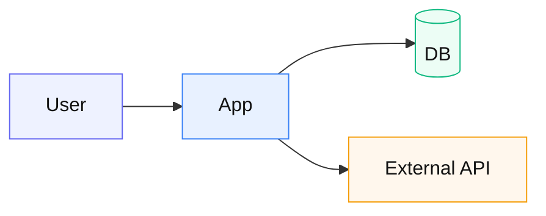

# Mermaid 共通トークン

図の色・箱スタイルを揃えるための定番。各フロー雛形の先頭で `%%` コメントとして参照するか、定義ブロックをコピーする。

## classDef（推奨コピペ）

```mermaid
%%{init: {"theme": "base", "themeVariables": {
  "primaryColor": "#E8F1FF",
  "primaryTextColor": "#111",
  "primaryBorderColor": "#3B82F6",
  "lineColor": "#64748B",
  "secondaryColor": "#F1F5F9",
  "tertiaryColor": "#FFF7ED"
}}}%%
flowchart LR
  classDef actor fill:#EEF2FF,stroke:#6366F1,color:#111
  classDef app fill:#E8F1FF,stroke:#3B82F6,color:#111
  classDef data fill:#ECFDF5,stroke:#10B981,color:#111
  classDef external fill:#FFF7ED,stroke:#F59E0B,color:#111
  classDef danger fill:#FEF2F2,stroke:#EF4444,color:#111
  classDef muted fill:#F8FAFC,stroke:#94A3B8,color:#334155
```

| class | 用途 | fill 目安 |
|-------|------|-----------|
| `actor` | 人・端末・ブラウザ | 紫系 |
| `app` | 自前アプリ / API | 青系 |
| `data` | DB / Sheets / ストア | 緑系 |
| `external` | 外部 SaaS / AI / LINE | 橙系 |
| `danger` | 障害・拒否・危険操作 | 赤系 |
| `muted` | 補助・キャッシュ・任意 | 灰系 |

## 適用例



## 色トークン（図以外でも流用）

| 名前 | hex | 用途 |
|------|-----|------|
| success | `#10B981` | OK / 同期成功 |
| warn | `#F59E0B` | 外部・注意 |
| error | `#EF4444` | 失敗・遮断 |
| info | `#3B82F6` | 自前サービス |
| neutral | `#64748B` | 矢印・枠 |
| ink | `#111827` | 本文 |

JSON 版: [colors.json](./colors.json)
